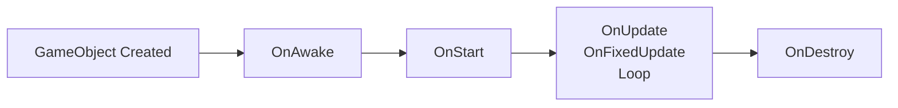
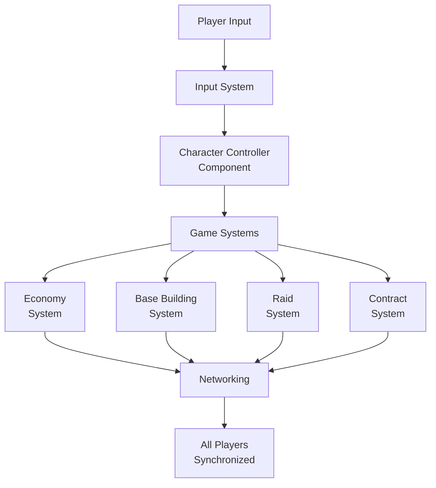
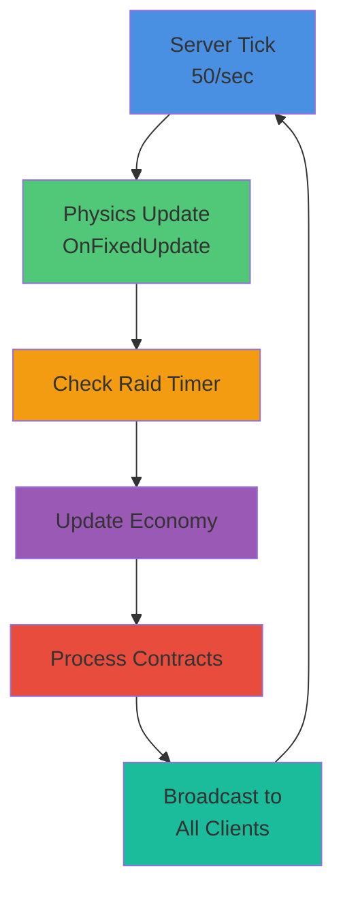

# Architecture

## Component Pattern

All game behavior uses the **Component pattern** inheriting from `Component`. This is the core architectural pattern for Basebound.

### Component Structure

```csharp
public sealed class MyComponent : Component
{
    [Property] public string Value { get; set; }      // Inspector-exposed
    [RequireComponent] ModelRenderer Body { get; set; } // Auto-linked

    protected override void OnAwake() { }        // Created, after deserialization
    protected override void OnStart() { }        // First frame, before OnFixedUpdate
    protected override void OnUpdate() { }       // Every frame
    protected override void OnFixedUpdate() { }  // Physics tick (50/sec)
    protected override void OnDestroy() { }      // Cleanup
}
```

### Key Attributes

- **`[Property]`** - Exposes property to inspector for drag-drop and configuration
- **`[RequireComponent]`** - Auto-references component on same GameObject (creates if missing)

### Best Practices

- Use `sealed` classes unless inheritance is explicitly required
- Expose configuration via `[Property]` attributes
- Auto-link dependencies with `[RequireComponent]`
- Keep lifecycle methods focused on their purpose
- See [Code/MyComponent.cs](../Code/MyComponent.cs) for the template example

## Component Lifecycle



**Lifecycle Details:**

1. **OnAwake()** - Called when component is created, after deserialization from scene
2. **OnStart()** - Called on first frame enable, before first OnFixedUpdate
3. **OnUpdate()** - Called every frame at variable rate
4. **OnFixedUpdate()** - Called at fixed physics timestep (50/sec, 20ms)
5. **OnDestroy()** - Called when component or GameObject is destroyed

## Gameplay Architecture



## Server Tick Cycle



## Project Structure

```
Code/               → Runtime components (game logic)
  ├── Assembly.cs  → Global usings
  ├── MyComponent.cs → Component template
  ├── PawnSystem/
  │   └── Client.cs → Networked player ownership (Local/Viewer statics)
  └── Properties/  → Launch settings

Editor/             → Editor-only tools (separate assembly)
  ├── Assembly.cs
  ├── MyEditorMenu.cs → Menu extension template
  └── Properties/

Assets/             → Scenes, materials, models
  ├── scenes/
  │   └── minimal.scene → Default startup scene
  ├── construct1.scene
  └── flatgrass1.scene

ProjectSettings/    → Engine configuration
  ├── Collision.config
  └── Input.config
```

## Pawn System Overview

- **Client Component** (`Code/PawnSystem/Client.cs`)
  - `[RequireComponent]`s `PlayerBase` so every networked player object carries persistent stats plus connection metadata.
  - Exposes `Client.Local` and `Client.Viewer` statics mirroring the hc1 pattern, letting UI elements and gameplay systems query the active viewpoint without scanning the scene.
  - Provides `Client.OnPossess( client, pawn )` for controllers to call whenever possession changes, keeping `Viewer` synchronized (spectating, respawn flows, etc.).
  - Stores connection identifiers (`SteamId`, `DisplayName`) via `[Sync]` so scoreboards and HUD elements share the same data set.

## Editor Extensions

Editor code is in the `Editor/` folder with a separate assembly. Extensions are added via menu attributes:

```csharp
[Menu("Editor", "Basebound/My Menu Option")]
public static void OpenMyMenu() { }
```

This is separate from runtime code and won't affect game builds. See [Editor/MyEditorMenu.cs](../Editor/MyEditorMenu.cs) for examples.

## Build & Run

1. **Launch S&box Editor**: `sbox-dev.exe -project "path/to/basebound.sbproj"`
2. **VS/IDE Debug**: Use [Code/Properties/launchSettings.json](../Code/Properties/launchSettings.json) "Editor" profile
3. **Hot Reload**: Code changes compile in milliseconds automatically during development

## API Reference

- **Global Usings**: `Sandbox`, `System.Collections.Generic`, `System.Linq` ([Code/Assembly.cs](../Code/Assembly.cs))
- **S&box Docs**: https://docs.facepunch.com/s/sbox-dev
- **S&box API**: https://sbox.game/api
