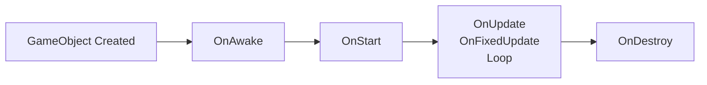
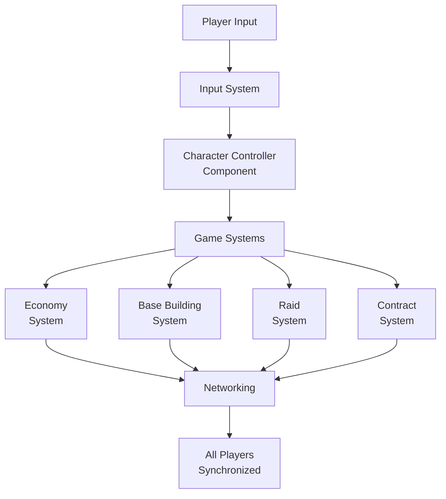
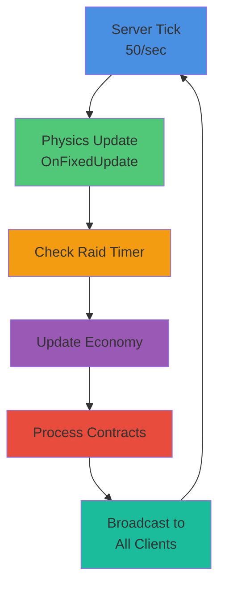

# Architecture

## Component Pattern

All game behavior uses the **Component pattern** inheriting from `Component`. This is the core architectural pattern for Basebound.

### Component Structure

```csharp
public sealed class MyComponent : Component
{
    [Property] public string Value { get; set; }      // Inspector-exposed
    [RequireComponent] ModelRenderer Body { get; set; } // Auto-linked

    protected override void OnAwake() { }        // Created, after deserialization
    protected override void OnStart() { }        // First frame, before OnFixedUpdate
    protected override void OnUpdate() { }       // Every frame
    protected override void OnFixedUpdate() { }  // Physics tick (50/sec)
    protected override void OnDestroy() { }      // Cleanup
}
```

### Key Attributes

- **`[Property]`** - Exposes property to inspector for drag-drop and configuration
- **`[RequireComponent]`** - Auto-references component on same GameObject (creates if missing)

### Best Practices

- Use `sealed` classes unless inheritance is explicitly required
- Expose configuration via `[Property]` attributes
- Auto-link dependencies with `[RequireComponent]`
- Keep lifecycle methods focused on their purpose
- See [Code/MyComponent.cs](../Code/MyComponent.cs) for the template example

## Component Lifecycle



**Lifecycle Details:**

1. **OnAwake()** - Called when component is created, after deserialization from scene
2. **OnStart()** - Called on first frame enable, before first OnFixedUpdate
3. **OnUpdate()** - Called every frame at variable rate
4. **OnFixedUpdate()** - Called at fixed physics timestep (50/sec, 20ms)
5. **OnDestroy()** - Called when component or GameObject is destroyed

## S&box API Usage Examples (from sbox-hc1)

### Component Configuration & Sync

```csharp
[Property, Category("Config")] public float Duration { get; set; } = 45f;
[Sync( SyncFlags.FromHost )] public TimeSince TimeSincePlanted { get; private set; }
[RequireComponent] public Spottable Spottable { get; private set; }
```

### Traces, Tags, and Scene Queries

```csharp
var trace = Scene.Trace.Ray( start, end )
    .IgnoreGameObjectHierarchy( GameObject.Root )
    .WithoutTags( "trigger", "ragdoll" )
    .Run();

GameObject.Tags.Add( "zone" );
var zones = Scene.GetAllComponents<Zone>();
```

### Audio, Resources, and Prefabs

```csharp
var resource = ResourceLibrary.Get<SoundEvent>( resourceId );
Sound.Play( resource, WorldPosition );

var explosion = ExplosionPrefab.Clone( WorldPosition, Rotation.Identity );
explosion.NetworkSpawn();
```

## UI, Prefabs, and Scenes (S&box patterns)

### Razor UI Composition

```razor
@inherits PanelComponent

@if (!IsHudEnabled)
    return;

<root>
    <ScreenProtectionOverlay />
    <KillFeed @ref="KillFeed" />
</root>

@code
{
    protected override int BuildHash()
    {
        return HashCode.Combine(IsHudEnabled, Client.Viewer.IsValid());
    }
}
```

### Scene JSON Composition

```json
{
  "Name": "Main Menu",
  "Components": [
    { "__type": "Sandbox.ScreenPanel" },
    { "__type": "Facepunch.UI.MainMenuPanel" },
    { "__type": "Sandbox.Audio.SoundEmitter" }
  ]
}
```

### Prefab JSON Composition

```json
{
  "RootObject": {
    "Name": "hud",
    "Components": [
      { "__type": "Facepunch.UI.MainHUD" },
      { "__type": "Sandbox.ScreenPanel" }
    ]
  }
}
```

### Scene Layering (Additive UI Scenes)

Sample modes split UI into a lightweight **engine scene** loaded additively on host startup:

- Host uses `Scene.Load` with `SceneLoadOptions.IsAdditive = true` to load an engine/UI scene once.
- Engine scene wires a `ScreenPanel` to Razor components like `Hud`, `Chat`, and `Scoreboard`.

### Prefab-Driven Player Composition

Player prefabs pack the entire pawn stack: controller, rigidbody, movement modes, inventory, camera, and custom gameplay components. This keeps spawn logic simple and repeatable:

- `GameObject.Clone("/player.prefab", ...)` + `NetworkSpawn` for owner-spawned pawns.
- Movement modes added as prefab components (`MoveModeWalk`, `MoveModeSwim`, `MoveModeLadder`).
- Custom input/logic components (inventory, stats, use) live alongside engine components.

### Gamemode State Graphs as Prefabs

Sample modes describe round flow directly in prefab hierarchies using `StateMachineComponent` + `StateComponent` nodes. Each node hosts rule components for that phase.

- Root `GameMode` object owns global rules and a child `States` hierarchy.
- Each `StateComponent` bundles rule components (respawn, UI, timers).

## Gameplay Architecture




## Server Tick Cycle



## Project Structure

```
Code/               → Runtime components (game logic)
  ├── Assembly.cs  → Global usings
  ├── MyComponent.cs → Component template
  ├── Player/
  │   ├── PlayerClient.cs → Networked player identity (Local/Viewer statics)
  │   └── PlayerState.cs  → Persistent player stats (health, currency, etc.)
  ├── UI/
  │   ├── HudDataBridge.cs → HUD projection layer (reads viewer + state)
  │   └── MainHUD.razor    → Root in-game HUD panel
  └── Properties/  → Launch settings

Editor/             → Editor-only tools (separate assembly)
  ├── Assembly.cs
  ├── MyEditorMenu.cs → Menu extension template
  └── Properties/

Assets/             → Scenes, materials, models
  ├── scenes/
  │   └── minimal.scene → Default startup scene
  └── prefabs/
      ├── heads_up_display.prefab → ScreenPanel + MainHUD + HudDataBridge
      ├── player_client.prefab    → PlayerClient + PlayerState (per-player data)
      └── player_pawn.prefab      → Physical pawn (movement/colliders/camera)

ProjectSettings/    → Engine configuration
  ├── Collision.config
  └── Input.config
```

## Pawn System Overview

Basebound follows a **Client / Pawn split**:

- **Client** answers: “who is this player?” (identity + persistent stats)
- **Pawn** answers: “what body is currently being controlled?” (physical object in the world)

This keeps HUD and game logic stable across death/respawn and future possession swaps (vehicles, drones, etc.).

### PlayerClient (the per-player identity)

- **Client Component** (`Code/Player/PlayerClient.cs`)
  - `[RequireComponent]`s `PlayerState`, so every player has persistent stats plus connection metadata.
  - Exposes `PlayerClient.Local` and `PlayerClient.Viewer` statics (hc1-style) so UI and gameplay can query “who are we?” and “whose view is this?” without scanning the scene.
  - Provides `PlayerClient.OnPossess( client, pawn )` for the pawn/controller layer to call whenever possession changes.
  - Stores identity fields (`SteamId`, `DisplayName`, `IsBot`) via `[Sync(SyncFlags.FromHost)]`.

> Note: Spectating/viewer swapping is intentionally restricted right now (gameplay/security: avoid revealing bases). The viewer is pinned to local.

### PlayerState (persistent stats)

- **PlayerState Component** (`Code/Player/PlayerState.cs`)
  - Holds health and other slice-1 stats.
  - Host-authoritative mutation (UI reads only).

### Prefabs (how this shows up in scenes)

- `Assets/prefabs/player_client.prefab`
  - Contains `PlayerClient` + `PlayerState`.
  - This is what HUD reads through the bridge.
- `Assets/prefabs/player_pawn.prefab`
  - Contains the physical pawn (movement, collisions, camera).
  - Spawned by `Sandbox.NetworkHelper` as the `PlayerPrefab`.
  - Includes `PlayerPawnBinder` to call `PlayerClient.OnPossess` on network spawn.

### Networked Spawn Flow

- `PlayerClientSpawner` spawns `player_client.prefab` on connection active.
- `NetworkHelper` spawns `player_pawn.prefab` and assigns ownership.
- `PlayerPawnBinder` runs on `OnNetworkSpawn` to bind the pawn to its `PlayerClient`.

## HUD Projection (HudDataBridge)

Basebound uses a small “bridge” layer so Razor UI doesn’t reach into world objects directly.

- `Code/UI/HudDataBridge.cs` samples `PlayerClient.Viewer` (and its `PlayerState`) and exposes HUD-safe values like health percent.
- The bridge is attached to `Assets/prefabs/heads_up_display.prefab`.

For the long-term architecture (control plane + rules + globals), see:

- `Docs/adr/0001-control-plane-and-hud-bridge.md`

## Editor Extensions

Editor code is in the `Editor/` folder with a separate assembly. Extensions are added via menu attributes:

```csharp
[Menu("Editor", "Basebound/My Menu Option")]
public static void OpenMyMenu() { }
```

This is separate from runtime code and won't affect game builds. See [Editor/MyEditorMenu.cs](../Editor/MyEditorMenu.cs) for examples.

## Build & Run

1. **Launch S&box Editor**: `sbox-dev.exe -project "path/to/basebound.sbproj"`
2. **VS/IDE Debug**: Use [Code/Properties/launchSettings.json](../Code/Properties/launchSettings.json) "Editor" profile
3. **Hot Reload**: Code changes compile in milliseconds automatically during development

## API Reference

- **Global Usings**: `Sandbox`, `System.Collections.Generic`, `System.Linq` ([Code/Assembly.cs](../Code/Assembly.cs))
- **S&box Docs**: https://docs.facepunch.com/s/sbox-dev
- **S&box API**: https://sbox.game/api
