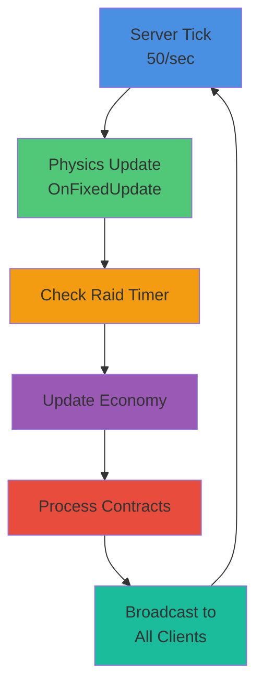

# Gameplay Systems

Basebound features several interconnected game systems that create the core gameplay loop. This document describes each system and how they interact.

## Overview



## Core Mechanics Patterns (Generic)

### Interaction and Use

```csharp
public UseResult CanUse( PlayerPawn player )
{
    return State is DoorState.Open or DoorState.Closed;
}

public void OnUse( PlayerPawn player )
{
    LastUse = 0f;
}
```

### Damage and Health

```csharp
[Property] public float Damage { get; set; } = 10f;
[Property] public float Interval { get; set; } = 0.5f;

void ITriggerListener.OnTriggerEnter( Collider other )
{
    if ( !Networking.IsHost ) return;
    var receiver = other.GameObject?.Root.GetComponentInChildren<IAreaDamageReceiver>();
    if ( !receiver.IsValid() ) return;
    receiver.ApplyAreaDamage( this );
}
```

### Audio and VFX

```csharp
var resource = ResourceLibrary.Get<SoundEvent>( resourceId );
if ( resource != null )
{
    Sound.Play( resource, WorldPosition );
}

if ( effectPrefab.IsValid() )
{
    effectPrefab.Clone( WorldPosition );
}
```

### Inventory and Equipment

```csharp
[Property] public EquipmentResource Resource { get; set; }

public UseResult CanUse( PlayerPawn player )
{
    if ( player.Inventory.CanTake( Resource ) == PlayerInventory.PickupResult.None )
        return "Can't pick this up";

    return true;
}
```

### Triggers and Zones

```csharp
GameObject.Tags.Add( "zone" );
var zones = Scene.GetAllComponents<Zone>();
```

## Game Systems


### Base Building System

**Purpose**: Allow players to construct and defend bases with strategic placement.

**Features**:
- Modular block placement
- Cost system (currency-based)
- Placement validation (collision, accessibility)
- Destruction mechanics for raids

**Key Components** (to implement):
- `BaseBuilder` - Handles block placement
- `BaseStructure` - Individual blocks with health
- `BaseBoundary` - Defines base territories

**Networking**: Block placements broadcast to all players via RPC.

### Economy System

**Purpose**: Active-idle progression through currency accumulation.

**Features**:
- Currency generation (passive & active)
- Transaction ledger
- Taxation system
- Balance persistence

**Key Components** (to implement):
- `EconomyManager` - Main economy controller
- `CurrencyPool` - Player balance tracking
- `TaxCollector` - Automatic tax processing

**Networking**: Economy state updated every tick via RPC broadcast.

### Raid System

**Purpose**: Timed PvP raids on bases with warrant mechanics.

**Features**:
- Raid scheduling (timed events)
- Warrant system (raid authorization)
- Base vulnerability windows
- Reward distribution

**Key Components** (to implement):
- `RaidScheduler` - Manages raid timers
- `RaidController` - Active raid state
- `WarrantManager` - Warrant issuance and validation

**Networking**: Raid events broadcast to all clients; damage synchronized via RPC.

### Contract System

**Purpose**: Skill-first dynamic objectives with deterministic rewards.

**Features**:
- Contract generation (varied difficulty)
- Skill-based completion mechanics
- Deterministic reward calculation
- Time limits and bonuses

**Key Components** (to implement):
- `ContractManager` - Contract lifecycle
- `ContractGenerator` - Dynamic contract creation
- `RewardCalculator` - Skill-based reward computation

**Networking**: Contract completion validated server-side; rewards broadcast via RPC.

## Low-Population Optimizations

Basebound is designed to be friendly on low-population servers:

- **Passive Economy**: Economy progresses even with few players
- **Scaled Events**: Raid frequency and intensity adjusts with player count
- **Accessible Contracts**: Contracts available for solo play
- **Cooperative Options**: Events that reward cooperation over pure PvP

## Server Tick Rate

- **Rate**: 50 ticks per second (20ms per tick)
- **Physics**: OnFixedUpdate called every tick
- **Networking**: State synchronized every tick for consistency
- **Raycasts**: Physics queries most accurate in OnFixedUpdate

## Adding New Systems

When implementing a new game system:

1. **Create Component**: Inherit from `Component` (see [architecture.md](architecture.md))
2. **Implement Lifecycle**: Use `OnFixedUpdate()` for server logic
3. **Add Networking**: Use `[Rpc.Broadcast]` for state changes
4. **Update Documentation**: Document in this file and [architecture.md](architecture.md)
5. **Add Tests**: Test in minimal.scene
6. **Follow Standards**: See [code-standards.md](code-standards.md)

**Example System**:

```csharp
public sealed class MyGameSystem : Component
{
    protected override void OnFixedUpdate()
    {
        if (IsProxy) return; // Server-only logic
        
        ProcessLogic();
        BroadcastUpdate();
    }
    
    [Rpc.Broadcast]
    public void BroadcastUpdate()
    {
        // All clients receive update
    }
}
```

## Related Documentation

- [architecture.md](architecture.md) - Component pattern and lifecycle
- [networking.md](networking.md) - Multiplayer synchronization
- [code-standards.md](code-standards.md) - Implementation standards
