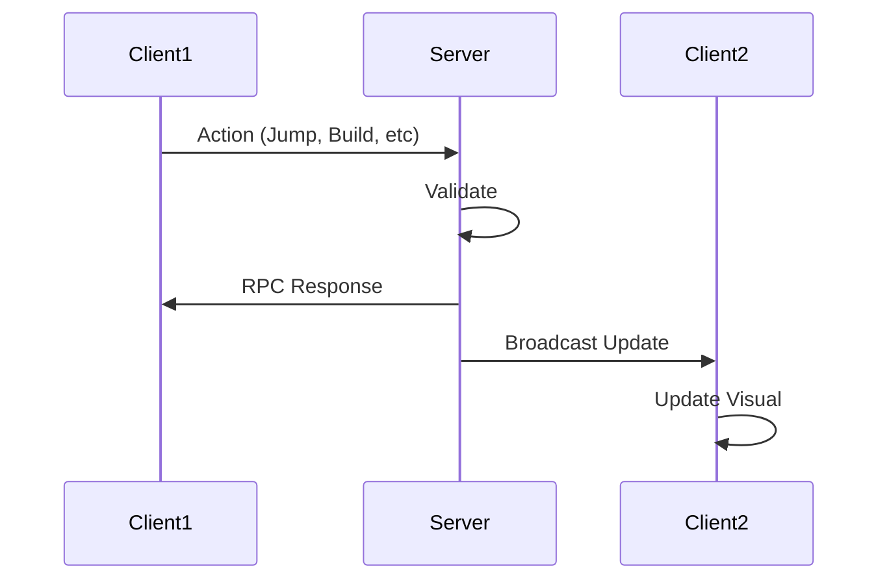

# Networking

Basebound is a multiplayer gamemode with full networking support. The game runs at **50 ticks/second** with client-server architecture.

## Overview

- **Architecture**: Client-server with RPC system
- **Tick Rate**: 50/sec (20ms per tick)
- **Max Players**: 64
- **Synchronization**: Event-based RPC with state broadcast

## Basic Networking

### Host Authority and RPC Filters

```csharp
if ( !Networking.IsHost ) return;

[Rpc.Broadcast( NetFlags.HostOnly )]
public void StartDefusing( PlayerPawn player ) { }

using ( Rpc.FilterInclude( Connection.Host ) )
{
    InflictDamage( target, damage, pos, dir, hitbox, flags );
}
```

### Owner-Only RPCs

```csharp
[Rpc.Owner]
public void Deploy()
{
    if ( IsDeployed ) return;
    IsDeployed = true;
}
```


### Spawning Networked Objects

```csharp
// Clone a networked prefab at a location
var go = PlayerPrefab.Clone(SpawnPoint.Transform.World);
go.NetworkSpawn();
```

### RPC (Remote Procedure Call)

Broadcasting an action to all clients:

```csharp
[Rpc.Broadcast]
public void OnJump() => Log.Info($"{this} jumped!");
```

### Proxy Objects

When you don't control an object (another player's character), it's a **proxy**:

```csharp
// Bad: Processes input for remote players
if (Input.Down("attack")) Fire();

// Good: Only process input if this client controls the object
if (!IsProxy && Input.Down("attack"))
{
    Fire();
}
```

## Network Flow



## Best Practices

### Lobby Bootstrapping

Sample modes typically create a lobby on host init (for multiplayer samples), then rely on `Component.INetworkListener.OnActive` to spawn per-connection prefabs.

### Input Validation


- **Client**: Apply input immediately for responsiveness (optimistic update)
- **Server**: Validate all input before applying state changes
- **Broadcast**: Update all other clients with validated results

### RPC Methods

1. Keep RPC methods focused and simple
2. Validate parameters server-side
3. Use `[Rpc.Broadcast]` for events all clients should see
4. Consider bandwidth for frequently-called RPCs

### State Synchronization

- Use fixed timestep `OnFixedUpdate()` for state that changes every tick
- Broadcast critical state changes via RPC
- Minimize network traffic with delta updates

### Network Performance

- Avoid excessive RPC calls (use bundling when possible)
- Synchronize only necessary game state
- Use proxy checks to avoid duplicate processing
- Profile network usage during development

## Networking Patterns

### Economy System (Example)

```csharp
public class EconomySystem : Component
{
    protected override void OnFixedUpdate()
    {
        if (IsProxy) return; // Server-only
        
        // Update economy state
        UpdatePlayerBalance();
        
        // Broadcast changes to all clients
        BroadcastEconomyUpdate();
    }
    
    [Rpc.Broadcast]
    public void BroadcastEconomyUpdate()
    {
        // All clients update their local economy view
        RefreshUI();
    }
}
```

### Base Building (Example)

```csharp
public class BaseBuilder : Component
{
    [Rpc.Broadcast]
    public void PlaceBlock(Vector3 position, int blockType)
    {
        if (!IsProxy) return; // Only execute on non-owning clients
        
        var block = SpawnBlock(blockType, position);
        // All clients now see the placed block
    }
}
```

## Related Documentation

- [CONTRIBUTING.md](../CONTRIBUTING.md) - Networking guidelines for contributors
- [architecture.md](architecture.md) - Component lifecycle and architecture
