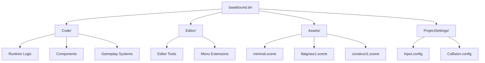
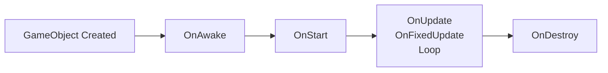
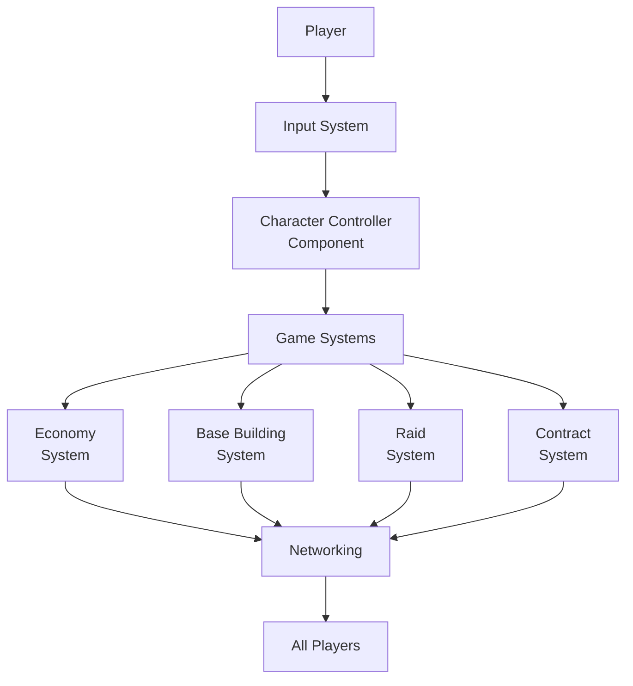
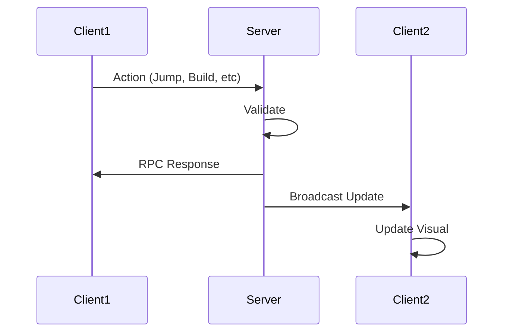
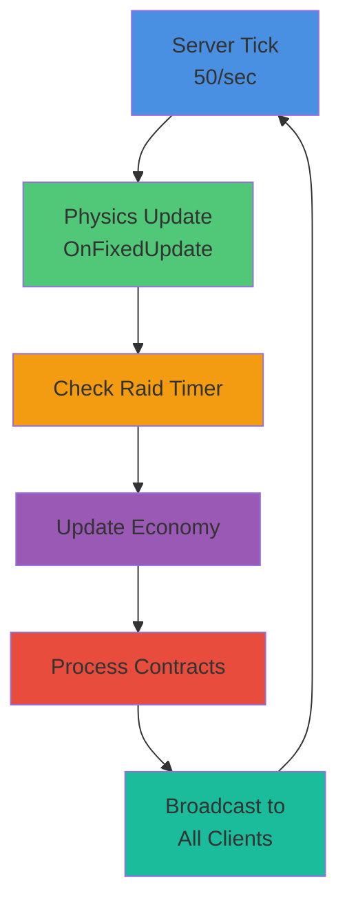

# Basebound

Basebound is a LmaoLlama **Basewars-style s&box gamemode** focused on **base building**, an **active-idle economy**, and **timed warrant raids**, with **skill-first contracts**, **deterministic rewards**, and **low-pop friendly events**.

## Overview

A multiplayer S&box gamemode built on the Source 2 engine with C# that emphasizes strategic base building, economic management, and PvP raid mechanics. Designed for both active players and casual, low-population servers.

## Key Features

- **Base Building**: Construct and defend your base with strategic placement
- **Active-Idle Economy**: Economic progression that works for both active players and idle playstyles
- **Timed Warrant Raids**: Scheduled PvP raids with warrant mechanics
- **Skill-First Contracts**: Reward-based contracts that value player skill
- **Deterministic Rewards**: Consistent, predictable reward systems
- **Low-Pop Friendly**: Optimized gameplay experience for smaller server populations

## Tech Stack

- **Engine**: S&box (Facepunch) - Source 2 engine
- **Language**: C# (.NET 10, C# 14)
- **Platform**: Multiplayer (64 players, 50 tick rate)
- **Architecture**: Component-based (GameObjects & Components)

## Project Structure

```
Code/           → Runtime components (game logic)
Editor/         → Editor-only tools (separate assembly)
Assets/         → Scenes (.scene JSON), materials, models
ProjectSettings/ → Input.config, Collision.config
Libraries/      → External dependencies
Localization/   → Localization files
```



## Getting Started

### Prerequisites

- S&box SDK
- .NET 10 SDK
- Visual Studio or VS Code

### Running the Project

1. Open the project with the S&box launcher
2. Default startup scene: `Assets/scenes/minimal.scene`
3. Launch editor: `sbox-dev.exe -project "path/to/basebound.sbproj"`

### Development

The project uses S&box's **millisecond hot-reload** system — code changes compile automatically and reload in real-time.

## Architecture

All game behavior uses the **Component pattern** inheriting from `Component`:

```csharp
public sealed class MyComponent : Component
{
    [Property] public string Value { get; set; }      // Inspector-exposed
    [RequireComponent] ModelRenderer Body { get; set; } // Auto-linked

    protected override void OnAwake() { }        // Created
    protected override void OnStart() { }        // First frame
    protected override void OnUpdate() { }       // Every frame
    protected override void OnFixedUpdate() { }  // Physics tick (50/sec)
    protected override void OnDestroy() { }      // Cleanup
}
```

### Component Lifecycle



### Gameplay Architecture



### Networking

Full multiplayer support with RPC and proxy object handling:

```csharp
// Spawn networked objects
var go = PlayerPrefab.Clone(SpawnPoint.Transform.World);
go.NetworkSpawn();

// RPC broadcast
[Rpc.Broadcast]
public void OnJump() => Log.Info($"{this} jumped!");
```

### Network Flow



## Documentation

- **S&box Docs**: https://docs.facepunch.com/s/sbox-dev
- **S&box API**: https://sbox.game/api
- **Project Config**: [basebound.sbproj](basebound.sbproj)

### Gameplay Loop



## License

This project is licensed under the **MIT License** - see [LICENSE](LICENSE) file for details.

### Attribution

Basebound is inspired by and based on concepts from:
- **Basewars** - Original Garry's Mod gamemode by RGaming
- **S&box** - Source 2 engine by Facepunch Studios
- **LmaoLlama** - Original concept and gamemode design

## Contributing

Contributions welcome! Please follow the component architecture patterns established in the project.
