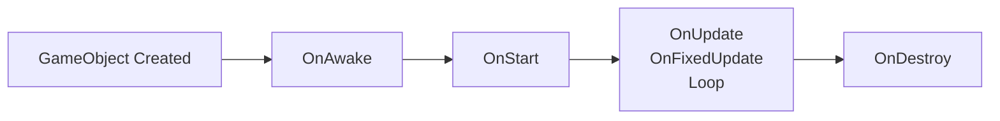

# Basebound

Basebound is a LmaoLlama **Basewars-style s&box gamemode** focused on **base building**, an **active-idle economy**, and **timed warrant raids**, with **skill-first contracts**, **deterministic rewards**, and **low-pop friendly events**.

## Overview

A multiplayer S&box gamemode built on the Source 2 engine with C# that emphasizes strategic base building, economic management, and PvP raid mechanics. Designed for both active players and casual, low-population servers.

## Key Features

- **Base Building**: Construct and defend your base with strategic placement
- **Active-Idle Economy**: Economic progression that works for both active players and idle playstyles
- **Timed Warrant Raids**: Scheduled PvP raids with warrant mechanics
- **Skill-First Contracts**: Reward-based contracts that value player skill
- **Deterministic Rewards**: Consistent, predictable reward systems
- **Low-Pop Friendly**: Optimized gameplay experience for smaller server populations

## Tech Stack

- **Engine**: S&box (Facepunch) - Source 2 engine
- **Language**: C# (.NET 10, C# 14)
- **Platform**: Multiplayer (64 players, 50 tick rate)
- **Architecture**: Component-based (GameObjects & Components)

## Getting Started

👉 **New to the project?** Start with [Setup & Getting Started](Docs/setup.md)

- Prerequisites, installation, and first run
- Development workflow and hot-reload
- Troubleshooting guide

## Documentation

Comprehensive documentation is available in the [Docs/](Docs/) directory:

- **[Setup & Getting Started](Docs/setup.md)** - Installation, project structure, first run
- **[Architecture](Docs/architecture.md)** - Component pattern, lifecycle, project structure
- **[Code Standards](Docs/code-standards.md)** - Naming conventions, coding patterns, best practices
- **[Networking](Docs/networking.md)** - Multiplayer implementation, RPC, synchronization
- **[Gameplay Systems](Docs/gameplay.md)** - Economy, raids, contracts, base building
- **[Contributing](CONTRIBUTING.md)** - Pull request process, development workflow
- **[AGENTS.md](AGENTS.md)** - AI agent instructions for development

### Quick Links

- **S&box Docs**: https://docs.facepunch.com/s/sbox-dev
- **S&box API**: https://sbox.game/api

## Architecture

All game behavior uses the **Component pattern**. See [Architecture](Docs/architecture.md) for details:

- Component lifecycle (OnAwake, OnStart, OnUpdate, OnFixedUpdate, OnDestroy)
- Best practices and patterns
- Project structure and organization

For a full example, see [Code/MyComponent.cs](Code/MyComponent.cs).

## License

This project is licensed under the **MIT License** - see [LICENSE](LICENSE) file for details.

### Attribution

Basebound is inspired by and based on concepts from:
- **Basewars** - Original Garry's Mod gamemode by RGaming
- **S&box** - Source 2 engine by Facepunch Studios
- **LmaoLlama** - Original concept and gamemode design

## Contributing

Contributions welcome! See [CONTRIBUTING.md](CONTRIBUTING.md) for:
- Development workflow and branch naming
- Code standards and best practices
- Pull request process and templates
- Areas to contribute
